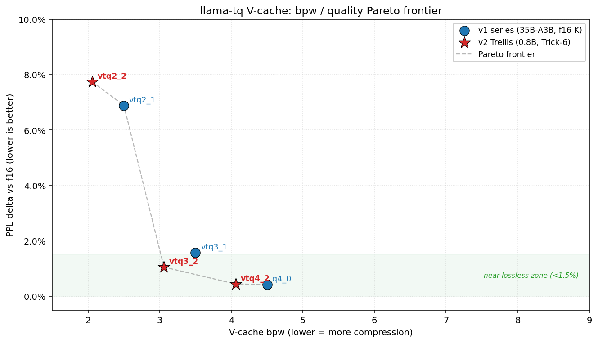
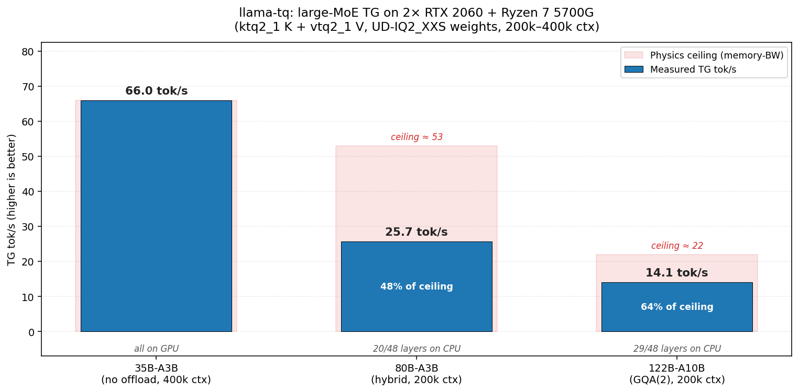
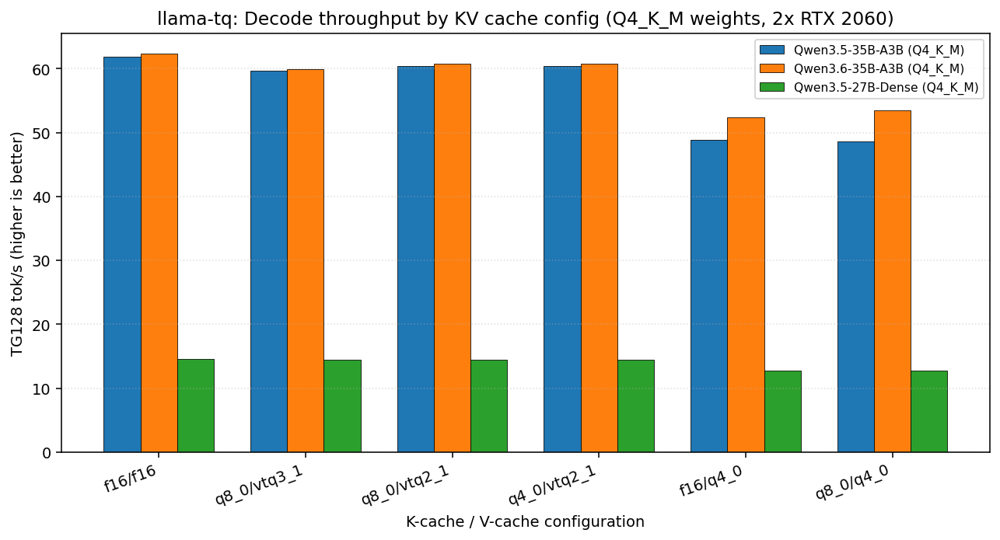
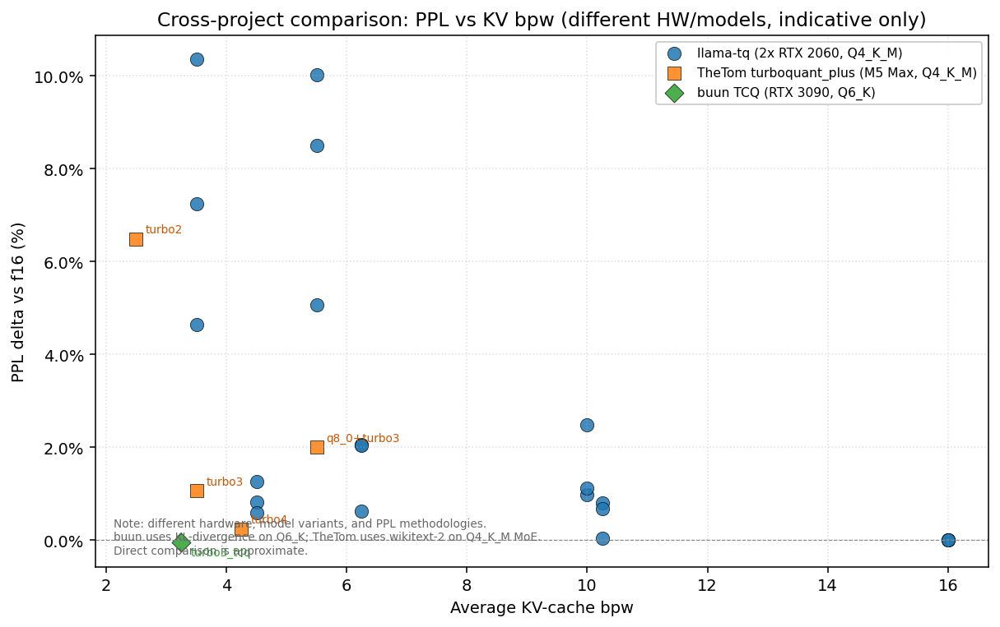

# llama-tq

[](LICENSE)
[](https://github.com/ggml-org/llama.cpp)
[-orange)](#hardware-notes)

Experimental llama.cpp fork focused on **KV-cache quantization**. Different K and V types, different dequant paths inside the Flash Attention kernel, a Trellis-coded V family for near-lossless 3-/4-bit V-cache, and large-MoE deployments on small cards.

> **tl;dr** — asymmetric `ktq2_1 / vtq2_1` gets a 35B MoE to 400k ctx on 24 GB total VRAM at ~3% TG cost. `vtq3_2` / `vtq4_2` (Trellis v2, research) sit in the near-lossless zone at 3.06 / 4.06 V-cache bpw. 80B and 122B MoEs run with expert-offload.



### Quality-vs-throughput score (35B-A3B IQ2_XXS, wikitext-2 ctx=2048/5ch + tg256)

Combined score: `ppl_delta_pct + 0.5 × tg_slowdown_pct`. Lower is better. f16/f16 is the reference.

| Score | K / V | Note |
|:---:|---|---|
|  0.00 | f16 / f16 | reference |
| **0.82** | **ktq2_1 / vtq2_2** | 🏆 best tradeoff |
|  1.69 | ktq4_1 / vtq4_1 | |
|  2.40 | ktq2_1 / vtq3_1 | deployed prod config |
|  2.47 | ktq3_1 / vtq3_1 | |
|  5.50 | ktq2_1 / vtq2_1 | |
| 17.66 | ktq1_1 / vtq1_1 | 1-bit floor, unusable |

From `autoresearch/baseline.json`. See the [autoresearch loop](autoresearch/README.md) for iterating on new quant variants.

---

## Contents

- [Highlights](#highlights)
- [Quick Start](#quick-start)
- [V-cache families](#v-cache-families)
- [Large-MoE deployments](#large-moe-deployments)
- [Benchmarks](#benchmarks)
- [Perplexity (wikitext-2)](#perplexity-wikitext-2)
- [KV memory savings](#kv-memory-savings)
- [How it works](#how-it-works)
- [Claude Code integration](#claude-code-integration)
- [Build](#build)
- [Roadmap](#roadmap)
- [When *not* to use this fork](#when-not-to-use-this-fork)

---

## Highlights

| Thing | Status |
|-------|--------|
| **KTQ K-cache** — RHT + Lloyd-Max, 2/3/4-bit, Q·K computed in Hadamard domain (no K dequant) | shipped, 4 types |
| **VTQ V-cache v1** — DHD rotation + Laplace-fit codebook, 1/2/3/4-bit, codebook lookup in FA inner loop | shipped, 4 types |
| **VTQ V-cache v2 (Trellis)** — group-Viterbi encoder + shift-register decoder at 2.06 / 3.06 / 4.06 bpw | research; CPU ref + CUDA dequant work, D=256 still broken |
| **Asymmetric K/V dispatch** — any KTQ K × any VTQ V through a single FA path | shipped |
| **Deferred K/V quantization** — f16 staging during prefill, bulk-convert at prefill→decode boundary; avoids repetition-loop pathology on K | auto-enabled for KTQ / VTQ\_2 |
| **Anthropic-compatible `/v1/messages`** with prompt caching, tool-call early-stop, `--keep` shift protection | shipped |

**Hardware target:** NVIDIA Turing (CC 7.5) — launch\_bounds and FA tuning are calibrated for sm\_75. **Runs on all CUDA GPUs from CC 6.1+** — Pascal (GTX 10-series), Turing (GTX 16 / RTX 20), Ampere (RTX 30), Ada (RTX 40) and Blackwell (RTX 50). On newer archs everything is functional but not yet arch-specifically tuned. Arch-specific contributions (FP8 Tensor Cores on Ada+, WGMMA on Hopper) welcome.

---

## Quick Start

```bash
cmake -B build -DGGML_CUDA=ON
cmake --build build -j$(nproc) --target llama-server

# Balanced quality, modest compression (6.25 avg bpw, +1–2% PPL)
./build/bin/llama-server -m model.gguf \
    --cache-type-k q8_0 --cache-type-v vtq3_1 \
    -fa on -ngl 99

# Maximum compression for long-ctx fits (3.5 avg bpw, ~7% PPL on IQ2 weights)
./build/bin/llama-server -m model.gguf \
    --cache-type-k ktq2_1 --cache-type-v vtq2_1 \
    -fa on -ngl 99

# Research preview: Trellis v2, near-f16 quality at 4-bit V (D=128 only)
./build/bin/llama-server -m model.gguf \
    --cache-type-k q8_0 --cache-type-v vtq4_2 \
    -fa on -ngl 99
```

K and V types are chosen independently. `--cache-type-k` accepts standard quants (`f16`, `q8_0`, `q4_0`, …) plus `ktq{1,2,3,4}_1`. `--cache-type-v` accepts the same standard quants plus `vtq{1,2,3,4}_1` and `vtq{2,3,4}_2`.

### Three presets

| Preset | K | V | Avg bpw | PPL Δ (35B UD-IQ2\_XXS) | VRAM saving vs f16/f16 |
|--------|---|---|:---:|:---:|:---:|
| **Safe** | `q8_0` | `vtq3_1` | 6.25 | +1.05% | 61% |
| **Balanced** | `ktq2_1` | `vtq2_1` | 3.0 | not yet 64-chunk re-measured | **81%** |
| **Research** | `q8_0` | `vtq4_2` | 6.03 | +0.44% (Qwen3.5-0.8B) | 62% |

---

## V-cache families

### v1 — VTQ (shipped, deployed)

Fixed D·H·D rotation (sign-diagonal · FWHT · sign-diagonal) applied once at the graph level, then a flat codebook lookup per entry in the FA inner loop. Laplace-fit codebooks at 1–2 index bits, uniform-like at 3–4.

| Type | Index bits | bpw | Block | Intended use |
|------|:---:|:---:|:---:|---|
| `vtq1_1` | 1 | 1.5 | 6 B | extreme VRAM, quality drops sharply |
| `vtq2_1` | 2 | 2.5 | 10 B | long-ctx default |
| `vtq3_1` | 3 | 4.0 | 16 B | near-f16 V-cache for quality-sensitive work |
| `vtq4_1` | 4 | 4.5 | 18 B | smallest codebook-fit error of v1 |

### v2 — VTQ Trellis (research)

Group-level Viterbi trellis with shared state and shared scale. 512-sample groups, 16-bit open-start state, inverse-Gaussian CDF code table. Receiver-side DP (atomic-free) is what makes the encoder fast and also reduces PPL vs the earlier sender-side variant.

| Type | Index bits | bpw | Block | PPL Δ vs f16 (0.8B wikitext-2) |
|------|:---:|:---:|:---:|:---:|
| `vtq2_2` | 2 | 2.06 | 132 B | +7.74% |
| `vtq3_2` | 3 | 3.06 | 196 B | **+1.05%** |
| `vtq4_2` | 4 | 4.06 | 260 B | **+0.44%** ← indistinguishable from f16 |

**Caveats:** v2 only works at head-dim D=128 at the moment; D=256 still crashes. Encoder is ~22 ms/call, which is why `--cache-type-v vtq*_2` auto-enables f16 staging during prefill and runs the bulk Viterbi exactly once at the prefill→decode boundary. No flag needed — logs say `deferred V quantization enabled (N layers with f16 staging)` on startup. Source: `docs/blog/2026-04-19-v-cache-validation.md`.

### KTQ K-cache

Per-block Randomized Hadamard Transform (FWHT + per-block sign flip) + Lloyd-Max codebook. The FA kernel applies FWHT to Q once per tile and computes Q·K entirely in the Hadamard domain — K is never explicitly dequantized in the vec path. On CC ≥ 8.0 an MMA-KTQ tensor-core path is also wired (untested locally).

| Type | Index bits | bpw | Block |
|------|:---:|:---:|:---:|
| `ktq1_1` | 1 | 2.5 | 10 B |
| `ktq2_1` | 2 | 3.5 | 14 B |
| `ktq3_1` | 3 | 4.5 | 18 B |
| `ktq4_1` | 4 | 5.5 | 22 B |

**Why deferred K:** KTQ K-cache suffers a repetition-loop pathology when quantized per-token during prefill — attention re-reads the just-quantized rows, RHT round-trip noise accumulates, and the model loops (`"Es war einfach. Es war einfach. Es war einfach."`). f16 staging during prefill + bulk-convert at prefill→decode avoids this. Auto-enabled for any KTQ type.

**Combining KTQ K with VTQ V:** works, this is the reference config. Expect super-additive PPL at the same nominal bpw — a 2-bit K + 2-bit V pair is noisier than a single 4-bit pair because FA softmax is sensitive to *correlated* K and V noise. For cleanest quality-per-byte pair `q8_0` or `q4_0` K with VTQ V.

---

## Large-MoE deployments

These are the three models that drive the fork's existence. All measured on the same box: Ryzen 7 5700G, 40 GB DDR4-3200 (~40 GB/s real), 2× RTX 2060 12 GB, PCIe asymmetric (GPU0 x16 / GPU1 x4).



The 35B fits fully on GPU. The 80B and 122B spill 20 / 29 of 48 layers to CPU RAM — TG becomes CPU-memory-bandwidth-bound, so the numbers are read against a physics ceiling (DDR4-3200 @ ~40 GB/s real / per-token CPU traffic).

### 35B-A3B — daily driver

Qwen3.5 or Qwen3.6 35B-A3B (32 experts / 4 active, GQA), UD-IQ2\_XXS weights. Fits fully on GPU at 400k ctx parallel 2 with `ktq2_1 / vtq2_2` (current best-tradeoff config, score 0.82 on the leaderboard at the top of this README).

```bash
./build/bin/llama-server -m Qwen3.6-35B-A3B-UD-IQ2_XXS.gguf \
    --host 0.0.0.0 --port 8791 -c 400000 -ngl 99 \
    --flash-attn on --no-mmap --parallel 2 \
    --cache-type-k ktq2_1 --cache-type-v vtq2_2 \
    --cache-reuse 256 -ub 512 -ts 12,12 \
    --jinja --reasoning off
```

| Config | Total VRAM | TG128 |
|--------|:---:|:---:|
| `ktq2_1 K` + `f16 V` (400k ctx, parallel 2) | 22.6 GB | 68 tok/s |
| `ktq2_1 K` + `vtq2_1 V` (400k ctx, parallel 2) | **19.3 GB** | 66 tok/s |

Full K × V sweep at shorter ctx in the [Benchmarks](#benchmarks) section.

### 80B-A3B — Qwen3-Next hybrid (DeltaNet + Attention)

Hybrid architecture, **512 experts / 10 active**. 80B params, ~25 GB at UD-IQ2\_XXS. 14 expert-layers per GPU, 20 offloaded to CPU RAM. Usable at 100k+ prompts.

```bash
./build/bin/llama-server -m Qwen3-Next-80B-A3B-Instruct-UD-IQ2_XXS.gguf \
    --host 0.0.0.0 --port 8791 -c 200000 -ngl 99 -ts 12,12 -fa on \
    --cache-type-k ktq2_1 --cache-type-v vtq2_1 \
    --parallel 1 --fit-target 128 \
    -ot "blk\.(0|1|2|3|4|5|6|7|8|9|10|11|12|13)\.ffn_(up|down|gate)_exps\.=CUDA0,\
blk\.(14|15|16|17|18|19|20|21|22|23|24|25|26|27)\.ffn_(up|down|gate)_exps\.=CUDA1,\
blk\.(2[89]|3[0-9]|4[0-7])\.ffn_(up|down|gate)_exps\.=CPU" \
    --jinja --reasoning off
```

Measured **25–28 tok/s TG** at 200k ctx. Physics ceiling on this box is ~53 tok/s (40 GB/s DDR4 / 0.75 GB per-token CPU traffic) — current 48% efficiency. Quick wins (thread pinning, ngram-spec for repetitive output) may push toward 32 tok/s without code changes.

### 122B-A10B — largest that fits

Qwen3.5-122B-A10B (256 experts / 8 active, GQA(2)). 34 GB weights at UD-IQ2\_XXS. 19 expert-layers on GPU (PCIe-aware 10+9 split), 29 offloaded to CPU RAM.

**5-run average:** **14.06 ± 0.49 tok/s TG, 28.4 ± 2.3 tok/s PP** at 200k ctx.

| K | V | ctx | VRAM GPU0/GPU1 | PP tok/s | TG tok/s |
|---|---|---|---|:---:|:---:|
| `ktq2_1` | `vtq2_1` | 2k (all-CPU) | — | 148 | 12.6 |
| `ktq2_1` | `vtq2_1` | 2k (10L GPU) | — | 175 (+18%) | 14.7 (+17%) |
| `ktq2_1` | `vtq2_1` | 200k | 10.9 / 10.5 GB | **28.4** | **14.06** |

Full `262144` ctx fits too — GQA(2) + TQ2\_1 means only +140 MB KV delta from 200k to 262k. TG is CPU-RAM-bandwidth-bound (2.5 GB/token at ~56 GB/s effective = ~22 tok/s physics ceiling, 64% efficiency).

**PCIe asymmetry matters:** GPU0 x16 / GPU1 x4 means heavier expert-load on GPU0 avoids x4 cross-traffic. 19L (10+9) beats balanced 9+9 by +2% TG and +11% PP-stability. Full sweep: [docs/bench-qwen35-122b-a10b.md](docs/bench-qwen35-122b-a10b.md).

---

## Benchmarks

All measurements: 2× RTX 2060 12 GB, Flash Attention on, `-p 512 -n 128 -r 2`. Build `f30e85aa5` / 2026-04-24 unless noted.



<details>
<summary><b>Qwen3.6-35B-A3B (UD-IQ2_XXS)</b> — full 21-config K × V matrix, dual-GPU <code>-ts 12,12</code></summary>

| K | V | PP512 | TG128 | ΔPP | ΔTG |
|---|---|:---:|:---:|:---:|:---:|
| **f16** | **f16** | **971.4** | **74.82** | baseline | baseline |
| f16 | vtq2\_1 | 908.2 | 73.83 | −6.5% | −1.3% |
| f16 | vtq3\_1 | 884.8 | 72.58 | −8.9% | −3.0% |
| **f16** | **vtq2\_2** | **963.7** | **74.03** | **−0.8%** | **−1.1%** |
| f16 | vtq3\_2 | 962.4 | 74.13 | −0.9% | −0.9% |
| f16 | q4\_0 | 648.9 | 66.70 | −33.2% | −10.8% |
| f16 | q8\_0 | 652.3 | 60.28 | −32.8% | −19.4% |
| ktq2\_1 | f16 | 950.4 | 73.19 | −2.2% | −2.2% |
| ktq2\_1 | vtq2\_1 | 885.9 | 72.18 | −8.8% | −3.5% |
| ktq2\_1 | vtq3\_1 | 857.9 | 71.12 | −11.7% | −4.9% |
| **ktq2\_1** | **vtq2\_2** | **941.0** | **72.51** | **−3.1%** | **−3.1%** |
| ktq2\_1 | vtq3\_2 | 941.4 | 72.37 | −3.1% | −3.3% |
| ktq2\_1 | q4\_0 | 636.6 | 64.74 | −34.5% | −13.5% |
| ktq2\_1 | q8\_0 | 646.6 | 62.74 | −33.4% | −16.2% |
| ktq3\_1 | f16 | 938.9 | 72.44 | −3.4% | −3.2% |
| ktq3\_1 | vtq2\_2 | 924.0 | 71.83 | −4.9% | −4.0% |
| ktq3\_1 | vtq3\_1 | 848.2 | 70.25 | −12.7% | −6.1% |
| ktq3\_1 | vtq3\_2 | 926.9 | 71.53 | −4.6% | −4.4% |
| q8\_0 | q8\_0 | 943.4 | 70.71 | −2.9% | −5.5% |
| q4\_0 | q4\_0 | 929.6 | 70.19 | −4.3% | −6.2% |
| q8\_0 | vtq2\_1 | 856.2 | 70.45 | −11.9% | −5.8% |

Rows in **bold** are the Pareto-interesting ones: `f16/vtq2_2` is near-free on FA (−0.8% PP, −1.1% TG) and `ktq2_1/vtq2_2` is the lightest-with-K-quant config at −3.1% / −3.1%.

**Observations:**
- **VTQ_2 (Trellis v2) is the cheapest V-cache on FA** — 0.8–1.1% slowdown vs f16, beats every VTQ_1 variant at the same or lower bpw. The deferred encoder + warp-parallel shift-register decoder keep the FA inner loop tight.
- **`q8_0` / `q4_0` as V destroys FA dispatch** — drops to ~650 PP, ~60 TG. Those legacy types fall out of the fastest FA path on CC 7.5. VTQ is smaller and faster.
- **`ktq2_1 + f16 V` is the lowest-overhead single-side compression** — 2.2% PP and 2.2% TG for ~40% KV savings. Good starting point if you don't need V-cache compression.
- **Asymmetric `ktq2_1 / vtq2_2` is the new Pareto winner** at 3.1% throughput cost for **~80% KV savings** (28.75 MiB vs 160 MiB total at ctx=8192). Replaces the old `ktq2_1 / vtq2_1` recommendation.

</details>

<details>
<summary><b>Gemma4-26B-A4B (bartowski IQ2_XXS)</b> — full 21-config K × V matrix, dual-GPU <code>-ts 12,12</code></summary>

26B MoE with 4B active, 30 layers, hybrid attention (iSWA), reasoning model with `<|channel>thought` format. FA-vec dispatch covers D=64/128/256/512 for all TQ types.

| K | V | PP512 | TG128 | ΔPP | ΔTG |
|---|---|:---:|:---:|:---:|:---:|
| **f16** | **f16** | **1395.74** | **82.70** | baseline | baseline |
| f16 | vtq2\_1 | 1054.38 | 78.95 | −24.5% | −4.5% |
| f16 | vtq3\_1 | 908.74 | 75.35 | −34.9% | −8.9% |
| **f16** | **vtq2\_2** | **1381.58** | **80.70** | **−1.0%** | **−2.4%** |
| f16 | vtq3\_2 | 1381.17 | 80.72 | −1.0% | −2.4% |
| f16 | q4\_0 | 326.56 | 32.23 | −76.6% | −61.0% |
| f16 | q8\_0 | 333.95 | 30.69 | −76.1% | −62.9% |
| ktq2\_1 | f16 | 1345.45 | 78.81 | −3.6% | −4.7% |
| ktq2\_1 | vtq2\_1 | 1025.33 | 75.36 | −26.5% | −8.9% |
| ktq2\_1 | vtq3\_1 | 889.54 | 71.92 | −36.3% | −13.0% |
| **ktq2\_1** | **vtq2\_2** | **1334.21** | **77.27** | **−4.4%** | **−6.6%** |
| ktq2\_1 | vtq3\_2 | 1331.86 | 77.21 | −4.6% | −6.6% |
| ktq2\_1 | q4\_0 | 328.68 | 31.37 | −76.5% | −62.1% |
| ktq2\_1 | q8\_0 | 330.06 | 28.88 | −76.4% | −65.1% |
| ktq3\_1 | f16 | 1342.35 | 78.82 | −3.8% | −4.7% |
| ktq3\_1 | vtq2\_2 | 1332.11 | 77.12 | −4.6% | −6.7% |
| ktq3\_1 | vtq3\_1 | 887.59 | 71.94 | −36.4% | −13.0% |
| ktq3\_1 | vtq3\_2 | 1328.92 | 77.01 | −4.8% | −6.9% |
| q8\_0 | q8\_0 | 1315.82 | 72.79 | −5.7% | −12.0% |
| q4\_0 | q4\_0 | 1312.87 | 72.26 | −5.9% | −12.6% |
| q8\_0 | vtq2\_1 | 938.08 | 71.06 | −32.8% | −14.1% |

Generates coherent reasoning output. Sample (greedy, `--log-verbose`):
- `<|channel>thought\nThe user is asking a simple factual question: "What is the capital of France?"...`

**Observations (vs Qwen3.6 sweep):**
- **VTQ_2 is the cheapest V-cache on Gemma4 too** — `f16/vtq2_2` is only 1.0% PP / 2.4% TG slowdown. Same Pareto position as on Qwen.
- **Legacy `q4_0` / `q8_0` as V is catastrophic** at D=512 — drops PP to ~330 (−76%), TG to ~32 (−61%). Gemma4's full-attention head dim is the worst case for those types.
- **VTQ_1 family suffers more on D=512** than on Qwen's D=128 — `f16/vtq2_1` is −24.5% PP (vs −6.5% on Qwen). Trellis-v2 (vtq2_2) wins decisively here.
- **`ktq2_1 / vtq2_2` Pareto winner**: −4.4% PP / −6.6% TG for ~80% KV savings. Slightly worse than Qwen's −3.1% / −3.1% — the V-rms-norm pre-quant interaction (Gemma4-specific) is the suspect.

**Earlier "gibberish" reports** were a test-harness artifact: llama-cli's interactive REPL prompt-prefix (`> `) made the actual reasoning tokens (control tokens not rendered on stdout) look like empty newlines. Token-ID dump confirms valid sampling. Add `--log-verbose` and grep `next token` to verify locally.

**Quants tested (both work):** [unsloth UD-IQ2_XXS](https://huggingface.co/unsloth/gemma-4-26B-A4B-it-GGUF), [bartowski IQ2_XXS](https://huggingface.co/bartowski/google_gemma-4-26B-A4B-it-GGUF).

</details>

---

## Perplexity (wikitext-2)

PPL is sensitive to weight quant. Historical numbers use 512 ctx / 3 chunks; the newer 2048 ctx / 5 chunks set below is from the 2026-04-24 matrix sweep and is the one the leaderboard above uses.

### Qwen3.6-35B-A3B (UD-IQ2\_XXS) — 2048 ctx, 5 chunks (preferred methodology)

Representative row from the full 5×8 K × V matrix. All KTQ bitrates produce the same PPL because the attention-only PPL eval can't distinguish K bpw within a forward pass; we show `ktq2_1` as the representative K since it's the lightest.

| K | V | PPL | vs f16/f16 |
|---|---|:---:|:---:|
| f16 | f16 | **6.7251** | — |
| ktq2\_1 | vtq4\_1 | 6.7101 | −0.22% (near-lossless) |
| ktq2\_1 | vtq2\_2 / 3\_2 / 4\_2 | 6.7227 | −0.04% |
| f16 | vtq2\_2 / 3\_2 / 4\_2 | 6.7388 | +0.20% |
| ktq2\_1 | vtq3\_1 | 6.7582 | +0.49% |
| ktq2\_1 | vtq2\_1 | 7.0140 | +4.30% |
| ktq2\_1 | vtq1\_1 | 7.8157 | +16.17% (1-bit floor) |

Full pivot + discussion: [docs/plans/2026-04-24-ktq-vtq2-combos.md](docs/plans/2026-04-24-ktq-vtq2-combos.md).

### Qwen3.6-35B-A3B (UD-IQ2\_XXS) — 512 ctx, 3 chunks (historical)

| K | V | KV bpw | PPL | vs f16/f16 |
|---|---|:---:|:---:|:---:|
| f16 | f16 | 16.0 | **5.967** | — |
| q8\_0 | q8\_0 | 8.5 | 6.006 | +0.65% |
| q4\_0 | q4\_0 | 4.5 | 6.001 | +0.57% |
| f16 | vtq3\_1 | 10.0 | 6.030 | **+1.05%** |
| q8\_0 | vtq2\_1 | 5.5 | 6.361 | +6.6% |
| f16 | vtq2\_1 | 9.3 | 6.378 | +6.9% |

### Qwen3.6-35B-A3B (Q4\_K\_M)

| K | V | PPL | vs f16/f16 |
|---|---|:---:|:---:|
| f16 | f16 | **5.127** | — |
| f16 | q4\_0 | 5.129 | +0.04% |
| q4\_0 | q4\_0 | 5.169 | +0.8% |
| f16 | vtq3\_1 | 5.177 | **+1.0%** |
| q8\_0 | vtq3\_1 | 5.232 | +2.1% |
| q4\_0 | vtq2\_1 | 5.498 | +7.2% |
| q8\_0 | vtq2\_1 | 5.563 | +8.5% |

### V-cache v2 Trellis (Qwen3.5-0.8B, 512 ctx, 5 chunks)

From `docs/blog/2026-04-19-v-cache-validation.md`, `tests/trellis-phase1/results/run22_08b_full_sweep.csv`.

| V type | bpw | PPL | Δ f16 |
|--------|:---:|:---:|:---:|
| f16 | 16.0 | 15.60 | — |
| vtq2\_2 | 2.06 | 16.80 | +7.74% |
| **vtq3\_2** | 3.06 | 15.76 | **+1.05%** |
| **vtq4\_2** | 4.06 | 15.67 | **+0.44%** |

**Why 2-bit is stuck at ~7%:** 4-state codebook hits an entropy floor for Gaussian/Laplace V entries. Paths to sub-2% at 2 bits on the roadmap: outlier-channel split (v6 VTQ\_OUT, designed) + correction overlay buffer (Trick 4, designed). Neither shipped yet.

### Decode throughput (tg256, 35B-A3B IQ2_XXS, measured 2026-04-24)

From `llama-bench -fa 1 -ngl 99 -n 256 -p 0 -r 2`. Running on 2× RTX 2060 12 GB.

| K cache | V cache | tok/s | vs f16/f16 |
|---------|---------|:---:|:---:|
| f16 | f16 | 73.40 | 100% |
| ktq2_1 | f16 | 72.77 | 99.1% |
| f16 | vtq2_2 | 73.01 | 99.5% |
| **ktq2_1** | **vtq2_2** | **72.00** | **98.1%** |
| ktq2_1 | vtq3_2 | 71.99 | 98.1% |
| ktq2_1 | vtq4_2 | 71.97 | 98.0% |
| ktq2_1 | vtq2_1 | 71.59 | 97.5% |
| ktq2_1 | vtq3_1 | 70.51 | 96.1% |
| ktq2_1 | vtq4_1 | 70.52 | 96.1% |

**Finding: VTQ_2 (Trellis) is 1.5–2% faster than VTQ_1 at the same bit class.** First measurable v2 decode advantage — the deferred-V + warp-parallel shift-register decoder keeps the FA inner loop tighter than the v1 codebook lookup. All three v2 variants run within 0.1% of each other at decode — the 2/3/4-bit V-cache choice is pure quality vs memory, not quality vs speed.

**Attention-only PPL caveat:** `llama-perplexity` never hits the prefill→decode transition, so deferred V conversion never fires. Within a single K-cache choice, `vtq{2,3,4}_2` all produce the same PPL (V stays in f16 staging). The 2048-ctx table above reflects the K-cache component; V_2 variants are orthogonally validated on Qwen3.5-0.8B and via the throughput benchmark table (VTQ_2 shows a measurable decode-path speed advantage). Decode-phase PPL for the full 35B V-cache delta is follow-up work.

---

## KV memory savings

Measured on Qwen3.6-35B-A3B-UD-IQ2_XXS at ctx=8192 (10 attention layers out of 48 have KV). Numbers are the actual allocated KV-cache size as reported by the runtime, not a theoretical bpw calculation.

### Full 5 × 8 K × V matrix — total KV in MiB (percentage of f16/f16)

| K \ V | f16 | vtq1_1 | vtq2_1 | vtq3_1 | vtq4_1 | vtq2_2 | vtq3_2 | vtq4_2 |
|-------|:---:|:---:|:---:|:---:|:---:|:---:|:---:|:---:|
| **f16**     | 160.0 (100%) | 87.50 (55%) | 92.50 (58%) | 100.00 (63%) | 102.50 (64%) | 91.25 (57%) | 96.25 (60%) | 101.25 (63%) |
| **ktq1_1**  |  92.50 (58%) | **20.00 (13%)** 🏆 | 25.00 (16%) |  32.50 (20%) |  35.00 (22%) | **23.75 (15%)** |  28.75 (18%) |  33.75 (21%) |
| **ktq2_1**  |  97.50 (61%) | 25.00 (16%) | 30.00 (19%) |  37.50 (23%) |  40.00 (25%) |  28.75 (18%) |  33.75 (21%) |  38.75 (24%) |
| **ktq3_1**  | 102.50 (64%) | 30.00 (19%) | 35.00 (22%) |  42.50 (27%) |  45.00 (28%) |  33.75 (21%) |  38.75 (24%) |  43.75 (27%) |
| **ktq4_1**  | 107.50 (67%) | 35.00 (22%) | 40.00 (25%) |  47.50 (30%) |  50.00 (31%) |  38.75 (24%) |  43.75 (27%) |  48.75 (30%) |

### Per-cache sizes (constant regardless of partner)

| Type  | Size (MiB @ ctx=8192, 10 layers) | Effective bpw |
|-------|:---:|:---:|
| f16   | 80.0  | 16.0 |
| ktq1_1 / vtq1_1 | 12.5 / 7.5   | 2.5 / 1.5 |
| ktq2_1 / vtq2_1 | 17.5 / 12.5  | 3.5 / 2.5 |
| ktq3_1 / vtq3_1 | 22.5 / 20.0  | 4.5 / 4.0 |
| ktq4_1 / vtq4_1 | 27.5 / 22.5  | 5.5 / 4.5 |
| vtq2_2 / vtq3_2 / vtq4_2 | 11.25 / 16.25 / 21.25 | 2.25 / 3.25 / 4.25 |

**Smallest usable:** `ktq1_1 / vtq1_1` at **20 MiB total (13% of f16/f16, 8× smaller)** — but vtq1_1 costs +16% PPL, not practical. **Smallest PPL-sensible:** `ktq1_1 / vtq2_2` at 23.75 MiB (15%, 6.7× smaller). For large contexts the absolute savings matter more — at 200k ctx on the Qwen3.5-122B-A10B GQA(2) config, `ktq2_1 / vtq2_1` is ~450 MB total vs ~2.3 GB at f16/f16.

Measurement note: the 10-layer count is Qwen3.6-35B-A3B specific (48 blocks total, 10 with attention after the MoE filter). Different architectures allocate KV on different block counts; scale the per-layer numbers accordingly.

---

## How it works

### Problem

A per-block V-dequant with a 32-element FWHT butterfly inside the FA inner loop pushed `vec_dot_KQV` past the 255-register/thread limit on CC 7.5 in this implementation. Register spills to local memory; in one observed case, corruption of the FA accumulator for some head/tile combinations (not fully characterized).

### Split K-path and V-path

```
KTQ K-path (FA inner loop):          VTQ V-path (FA inner loop):
  // no K dequant at all               float val = codebook[idx] * scale;
  // Q is FWHT'd once per tile         // done — __forceinline__
  dot = <Q_hat, K_indices>
```

- **KTQ** keeps per-block RHT on K. Q is transformed once per tile; Q·K happens in the Hadamard domain.
- **VTQ** lifts the randomization out of the FA inner loop: one D·H·D rotation applied at graph level before writes. Per-entry dequant is just `codebook[idx] * scale`.

The D·H·D rotation is not fully random (deterministic sign diagonals), but the Hadamard mixing decorrelates the D-dim value vector enough that coordinate marginals match Laplace(0, 1) closely. That's what the 2-bit Lloyd-Max codebook relies on — not strict i.i.d.

### Trellis v2 (research)

Group-level Viterbi DP encodes 512 samples jointly against a fixed inverse-Gaussian CDF code table, with a shared 16-bit open-start state stored per group. Decode is a shift register: `state = (state >> K) | (bits << (L-K))`, one sample per iteration. The encoder is expensive (~22 ms/call); runtime amortizes this via prefill→decode bulk conversion.

Source: `ggml/src/ggml-trellis.{h,c}`, original port from `tests/trellis-phase1/`.

---

## Claude Code integration

The server exposes `/v1/messages` (Anthropic-compatible), so Claude Code can talk to it directly:

```bash
./scripts/onllama-launch-claude.sh --server http://localhost:8080
```

Server-side features wired in:

- **Tool-call early-stop** — `</tool_call>` stop sequence on `/v1/messages` with `tools:[]`, saves 1–15 s per agent turn.
- **`--keep 8192`** — pins the first 8k prompt tokens across context shifts, protecting the Claude Code system prompt (~15–25k) from silent discard.
- **`--cache-reuse 256`** — KV-shift-based prompt-prefix reuse across turns. Second-turn latency ~60 s → ~5–10 s on 35B.
- **Anthropic prompt caching** — `cache_control:{type:"ephemeral"}` markers on `system`, `messages.content`, `tools` are parsed and persisted to `<slot_save_path>/anthropic-cache/` with 5m/1h TTL and refresh-on-hit. Enable via `--slot-save-path PATH`.
  - **Hybrid/recurrent models:** a companion `.ckpt` is written alongside each blob and re-injected into `slot.prompt.checkpoints` on restore. Response fields are always correct; wall-time speedup is limited on models whose memory can't be truncated at arbitrary positions (Qwen3-Next etc.).
- **Full Anthropic `usage` shape** — `cache_read_input_tokens`, `cache_creation_input_tokens`, `cache_creation.ephemeral_5m/1h_input_tokens` all emitted.
- **TCP\_NODELAY on SSE** — removes ~40 ms Nagle stalls per chunk on streaming.
- **gzip** (opt-in, `LLAMA_SERVER_ZLIB=ON`) — 4–6× on tool-call JSON, non-streaming only.

Full setup incl. SSH tunnel: [docs/claude-code.md](docs/claude-code.md).

---

## Build

```bash
cmake -B build -DGGML_CUDA=ON
cmake --build build -j$(nproc)

# All KTQ × VTQ FA kernel combinations (longer build):
cmake -B build -DGGML_CUDA=ON -DGGML_CUDA_FA_ALL_QUANTS=ON
```

CUDA CC 6.1+. CPU fallback available for all KTQ / VTQ types.

### Hardware notes

sm\_75 (Turing / RTX 2060) is the only calibration target. FA `launch_bounds` and thread-count tuning are set for Turing's SM layout. On Ampere/Ada/Hopper the code compiles and should run, but the MMA-KTQ tensor-core path is untested and the FA tuning is probably sub-optimal.

---

## Roadmap

**Shipped**
- KTQ1\_1 / 2\_1 / 3\_1 / 4\_1
- VTQ1\_1 / 2\_1 / 3\_1 / 4\_1
- Asymmetric KTQ × VTQ dispatch through FA
- Deferred K/V (auto-gated by type)
- Attention-sink protection (first 4 tokens in f16)
- MMA-KTQ asymmetric dispatch — KTQ K + f16 V takes the tensor-core MMA path via bulk K→f16 split-dequant. Reference 35B IQ2\_XS: PP512 **875** (vs f16 861), PP2048 **868** (vs 857), TG128 67 (vs 71). 9.5× jump over the pre-fix 92 t/s.
- Anthropic `/v1/messages` with prompt caching

**Active research**
- VTQ2\_2 / 3\_2 / 4\_2 Trellis v2 — D=128 works, D=256 broken
- VTQ\_OUT (outlier-channel split) — designed, not implemented. Path to sub-2% PPL at 2-bit V.
- Correction Overlay Buffer (Trick 4) — designed, not implemented. Top-N lossless error patch.
- `mmvq` IQ2\_XS tuning on sm\_75 — 28% of kernel time on current 35B config

**Discarded after measurement**
- Speculative decoding on A3B MoE — expert-saturation pathology makes it ineffective
- VTQ\_MIXED — dominated by VTQ3\_1, not CUDA-ported
- Calibrated outlier selection — marginal gain after RHT
- MMA-KTQ split-dequant as default for all ctx — regresses past ~512 tokens; now short-ctx only

**Not on roadmap**
- FA3 (requires sm\_80+)
- Paged attention (scope mismatch)
- Multi-node inference

---

## When *not* to use this fork

- **VRAM is not a constraint.** Upstream llama.cpp with f16 KV is simpler and equally fast.
- **Sub-50 ms/token latency at long ctx matters.** VTQ V-cache adds per-token dequant overhead that grows with context length.
- **Multi-node serving.** This fork makes zero changes to llama.cpp's split logic.
- **Ampere+ (CC 8.0+).** Untested. The sm\_75-specific tuning is not going to be a good default there.

---

## Cross-project numbers

Other KV-quant forks exist (TheTom symmetric TurboQuant, buun TCQ trellis). They run on different hardware, weights, and metrics, so a side-by-side table would be misleading. Run them on the same model + hardware you care about.



---

## License

MIT, inherited from upstream llama.cpp. No restrictions.
