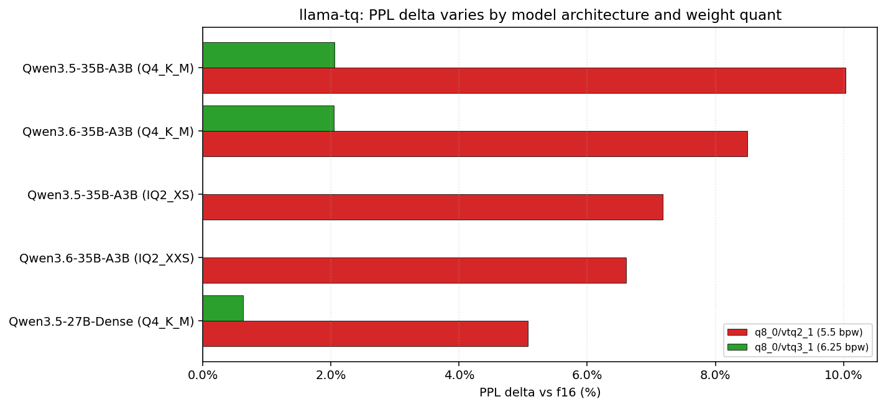

# llama-tq

[](LICENSE)

Asymmetric KV-cache quantization for llama.cpp. K-cache and V-cache use different quant types with different dequant paths inside the Flash Attention kernel.

Fork of [llama.cpp](https://github.com/ggml-org/llama.cpp), inspired by [TurboQuant](https://arxiv.org/abs/2504.19874) (Zandieh et al., arXiv preprint April 2025). See [References](#references) for explicit deviations from the paper.

> **Measured on 2x RTX 2060 12GB (CC 7.5), 5 model/quant pairs:**
> - `q8_0` K + `vtq2_1` V (5.5 bpw avg): **+5.1% to +10.0%** PPL Δ depending on model, ~65% KV VRAM vs f16
> - `q8_0` K + `vtq3_1` V (6.25 bpw avg): **+0.6% to +2.5%** PPL Δ
> - TG128 overhead: **−1% to −4%** with `vtq*` V-cache (vs −12% to −22% with `q4_0` V-cache)
> - CUDA only. PPL measurements are at 3 wikitext-2 chunks (noisy), proper 64+ chunk reruns pending.


---

## Quick Start

```bash
cmake -B build -DGGML_CUDA=ON
cmake --build build -j$(nproc) --target llama-server

# Recommended: high-quality K + compressed V
./build/bin/llama-server -m model.gguf \
    --cache-type-k q8_0 --cache-type-v vtq2_1 \
    -fa on -ngl 99

# Production deploy — KTQ2_1 K + f16 V + 400k ctx on 2x RTX 2060 12GB
# (this is the live config for Qwen3.6-35B-A3B on gpu00.node:8791)
./build/bin/llama-server -m /path/to/Qwen3.6-35B-A3B-UD-IQ2_XXS.gguf \
    --host 0.0.0.0 --port 8791 \
    -c 400000 -ngl 99 --flash-attn on --no-mmap --parallel 2 \
    --cache-type-k ktq2_1 --cache-type-v f16 \
    -ub 512 -ts 12,12 --jinja --reasoning off
# Notes:
#  - Deferred K quantization auto-enables for KTQ types (f16 staging during
#    prefill, bulk-convert at prefill→decode). Avoids repetition-loop pathology.
#  - --parallel 2 gives two 200k-ctx slots on this config.
#  - -ts 12,12 splits weights evenly across two 12 GB GPUs.
```

## Recommended Configurations

PPL impact is model-dependent; ranges below span the four tested Qwen3.5/3.6 configurations.

| Config | K | V | Avg bpw | PPL Δ (range) | Notes |
|--------|---|---|:---:|---|---|
| Safe | `q8_0` | `vtq3_1` | 6.25 | +0.6% to +2.5% | quality-first |
| Balanced | `q4_0` | `vtq3_1` | 4.25 | +0.6% to +2.5% (est.) | general use |
| Compact | `q8_0` | `vtq2_1` | 5.5 | +5.1% to +10.0% | VRAM/quality tradeoff |
| Aggressive | `q4_0` | `vtq2_1` | 3.5 | +7.2% to +10.4% | long context, VRAM-limited |

---

## Benchmarks

All benchmarks on **2x NVIDIA RTX 2060 12GB** (CC 7.5, PCIe 3.0), Flash Attention on, all layers offloaded.

### Throughput (llama-bench, PP512/TG128)


#### Qwen3.5-35B-A3B (IQ2_XS, 10.16 GiB)

| K-Cache | V-Cache | PP512 tok/s | TG128 tok/s | PP vs f16 | TG vs f16 |
|---------|---------|:---:|:---:|:---:|:---:|
| f16 | f16 | **731** | **58.8** | baseline | baseline |
| q8_0 | vtq2_1 | 684 | 57.5 | -6% | **-2%** |
| q4_0 | vtq2_1 | 682 | 57.4 | -7% | **-2%** |
| q8_0 | vtq3_1 | 664 | 56.9 | -9% | -3% |
| q4_0 | f16 | 531 | 49.1 | -27% | -17% |
| q8_0 | q4_0 | 485 | 50.6 | -34% | -14% |
| f16 | q4_0 | 483 | 49.3 | -34% | -16% |

#### Qwen3.6-35B-A3B (UD-IQ2_XXS, 10.01 GiB)

| K-Cache | V-Cache | PP512 tok/s | TG128 tok/s | PP vs f16 | TG vs f16 |
|---------|---------|:---:|:---:|:---:|:---:|
| f16 | f16 | **820** | **60.1** | baseline | baseline |
| q8_0 | vtq2_1 | 757 | 58.7 | -8% | **-2%** |
| q4_0 | vtq2_1 | 756 | 58.8 | -8% | **-2%** |
| q8_0 | vtq3_1 | 735 | 58.1 | -10% | -3% |
| f16 | vtq2_1 | 760 | 59.5 | -7% | **-1%** |
| f16 | q4_0 | 508 | 49.3 | -38% | -18% |
| q4_0 | f16 | 571 | 48.9 | -30% | -19% |

Across the tables above, `vtq2_1` V-cache yields higher PP512 and TG128 than `q4_0` V-cache (e.g. 757 vs 508 PP512 on Qwen3.6-35B IQ2_XXS). Likely cause: VTQ V-dequant in the FA inner loop is a single codebook load (`__forceinline__`), whereas q4_0 V-dequant does per-lane shift+scale arithmetic. I have not isolated the effect with nsight-compute; this is an empirical observation on CC 7.5, not a proven register-pressure argument.

#### Qwen3.5-35B-A3B (Q4_K_M, 19.92 GiB)

| K-Cache | V-Cache | PP512 tok/s | TG128 tok/s | PP vs f16 | TG vs f16 |
|---------|---------|:---:|:---:|:---:|:---:|
| f16 | f16 | **842** | **61.9** | baseline | baseline |
| q8_0 | vtq2_1 | 781 | 60.4 | -7% | **-2%** |
| q4_0 | vtq2_1 | 783 | 60.4 | -7% | **-2%** |
| q8_0 | vtq3_1 | 757 | 59.7 | -10% | -4% |
| f16 | q4_0 | 519 | 48.9 | -38% | -21% |
| q8_0 | q4_0 | 527 | 48.6 | -37% | -22% |

#### Qwen3.6-35B-A3B (Q4_K_M, 19.91 GiB)

| K-Cache | V-Cache | PP512 tok/s | TG128 tok/s | PP vs f16 | TG vs f16 |
|---------|---------|:---:|:---:|:---:|:---:|
| f16 | f16 | **847** | **62.4** | baseline | baseline |
| q8_0 | vtq2_1 | 781 | 60.7 | -8% | **-3%** |
| q4_0 | vtq2_1 | 783 | 60.7 | -8% | **-3%** |
| q8_0 | vtq3_1 | 756 | 59.9 | -11% | -4% |
| f16 | q4_0 | 524 | 52.4 | -38% | -16% |
| q8_0 | q4_0 | 521 | 53.5 | -38% | -14% |

#### Qwen3.5-27B Dense (Q4_K_M, 15.94 GiB)

| K-Cache | V-Cache | PP512 tok/s | TG128 tok/s | PP vs f16 | TG vs f16 |
|---------|---------|:---:|:---:|:---:|:---:|
| f16 | f16 | **318** | **14.6** | baseline | baseline |
| q8_0 | vtq2_1 | 297 | 14.5 | -7% | **-1%** |
| q4_0 | vtq2_1 | 297 | 14.5 | -7% | **-1%** |
| q8_0 | vtq3_1 | 288 | 14.4 | -9% | -1% |
| f16 | q4_0 | 205 | 12.8 | -36% | -12% |
| q8_0 | q4_0 | 214 | 12.8 | -33% | -12% |

The 27B Dense model is slower in absolute tok/s (no MoE sparsity: all 27B parameters active per token) but shows the same -1 to -2% TG128 overhead pattern for `vtq2_1` / `vtq3_1`.

### Perplexity (wikitext-2, 512 ctx, 3 chunks)

#### Qwen3.5-35B-A3B (IQ2_XS)

| K-Cache | V-Cache | KV bpw | PPL | vs baseline |
|---------|---------|:---:|:---:|:---:|
| f16 | f16 | 16.0 | **6.598** | -- |
| q8_0 | q8_0 | 8.5 | 6.600 | +0.03% |
| q4_0 | q4_0 | 4.5 | 6.619 | +0.32% |
| f16 | vtq3_1 | 10.0 | 6.716 | +1.8% |
| q8_0 | vtq2_1 | 5.5 | **7.072** | **+7.2%** |
| f16 | vtq2_1 | 9.3 | 7.115 | +7.8% |
| ktq2_1 | f16 | 9.8 | 7.246 | +9.8% |

#### Qwen3.6-35B-A3B (UD-IQ2_XXS)

| K-Cache | V-Cache | KV bpw | PPL | vs baseline |
|---------|---------|:---:|:---:|:---:|
| f16 | f16 | 16.0 | **5.967** | -- |
| q8_0 | q8_0 | 8.5 | 6.006 | +0.65% |
| q4_0 | q4_0 | 4.5 | 6.001 | +0.57% |
| f16 | vtq3_1 | 10.0 | 6.030 | **+1.05%** |
| q8_0 | vtq2_1 | 5.5 | **6.361** | **+6.6%** |
| f16 | vtq2_1 | 9.3 | 6.378 | +6.9% |

On IQ2_XS/IQ2_XXS weights, `vtq3_1` sits at +1.05–1.8% PPL and `q8_0 + vtq2_1` at +6.6–7.2%. The Q4_K_M results below show larger deltas. See the [Observation](#perplexity-wikitext-2-512-ctx-3-chunks) block after the Q4_K_M tables.

#### Qwen3.5-35B-A3B (Q4_K_M)

| K-Cache | V-Cache | PPL | vs baseline |
|---------|---------|:---:|:---:|
| f16 | f16 | **5.205** | -- |
| f16 | q4_0 | 5.247 | +0.8% |
| q4_0 | q4_0 | 5.271 | +1.3% |
| q8_0 | vtq3_1 | 5.312 | **+2.1%** |
| f16 | vtq3_1 | 5.334 | +2.5% |
| q8_0 | vtq2_1 | 5.727 | **+10.0%** |
| q4_0 | vtq2_1 | 5.744 | +10.4% |

#### Qwen3.6-35B-A3B (Q4_K_M)

| K-Cache | V-Cache | PPL | vs baseline |
|---------|---------|:---:|:---:|
| f16 | f16 | **5.127** | -- |
| f16 | q4_0 | 5.129 | +0.04% |
| q4_0 | q4_0 | 5.169 | +0.8% |
| f16 | vtq3_1 | 5.177 | **+1.0%** |
| q8_0 | vtq3_1 | 5.232 | +2.1% |
| q4_0 | vtq2_1 | 5.498 | +7.2% |
| q8_0 | vtq2_1 | 5.563 | +8.5% |

#### Qwen3.5-27B Dense (Q4_K_M)

| K-Cache | V-Cache | PPL | vs baseline |
|---------|---------|:---:|:---:|
| f16 | f16 | **6.343** | -- |
| q4_0 | q4_0 | 6.381 | +0.6% |
| q8_0 | vtq3_1 | 6.383 | **+0.6%** |
| f16 | q4_0 | 6.386 | +0.7% |
| f16 | vtq3_1 | 6.414 | +1.1% |
| q4_0 | vtq2_1 | 6.638 | +4.7% |
| q8_0 | vtq2_1 | 6.665 | +5.1% |

**Observation.** `q8_0 + vtq2_1` PPL delta varies by model and weight quantization:
- Qwen3.5-27B Dense (Q4_K_M): +5.1%
- Qwen3.5-35B-A3B MoE (IQ2_XS): +7.2%
- Qwen3.6-35B-A3B MoE (Q4_K_M): +8.5%
- Qwen3.5-35B-A3B MoE (Q4_K_M): +10.0%

The Dense model shows the smallest delta. The two MoE models on Q4_K_M weights show larger deltas than the same architecture on IQ2_XS weights, which I did not anticipate. Higher-precision weights amplifying KV-quant PPL is counterintuitive. One hypothesis is that MoE sparse expert routing (8/128 active) interacts with V-quant noise differently per-token, but I have not confirmed this. The measurement is on 3 wikitext-2 chunks at 512 ctx, so the chunk-to-chunk variance is non-trivial; I plan to rerun at 64+ chunks before drawing conclusions. `vtq3_1` stays within +0.6% to +2.5% across all four tests.



### KV-Cache Memory (4096 ctx)

| Config | KV Size | Savings vs f16 |
|--------|:---:|:---:|
| f16 / f16 | 40.0 MiB | -- |
| q8_0 / vtq2_1 | 13.8 MiB | **65%** |
| q4_0 / vtq3_1 | 10.6 MiB | **73%** |
| q4_0 / vtq2_1 | 8.7 MiB | **78%** |
| ktq2_1 / vtq2_1 | 7.5 MiB | **81%** |

### Comparison with Other Approaches

PPL delta vs f16 baseline (lower is better). Different hardware, models, and metrics. Relative deltas only are indicative.


| Approach | Type | bpw | PPL Delta | Decode Delta | Hardware | Model | Model Quant |
|----------|------|:---:|:---:|:---:|---|---|---|
| buun turbo3_tcq | K+V trellis | 3.25 | **-0.05%**\*\* | **-3%** | RTX 3090 | Qwen3.5-27B | Q6_K |
| TheTom turbo4 | K+V sym | 4.25 | **+0.23%** | -7% | M5 Max | Qwen3.5 MoE | Q4_K_M |
| **llama-tq vtq3_1** (Qwen3.6) | V-only | 4.0 | **+1.0%** | **-3%** | 2x RTX 2060 | Qwen3.6-35B MoE | Q4_K_M |
| TheTom turbo3 | K+V sym | 3.5 | +1.06% | -10% | M5 Max | Qwen3.5 MoE | Q4_K_M |
| **llama-tq vtq3_1** (27B) | V-only | 4.0 | +1.1% | **-1%** | 2x RTX 2060 | Qwen3.5-27B | Q4_K_M |
| **llama-tq vtq3_1** (IQ2_XS) | V-only | 4.0 | +1.8% | **-2%** | 2x RTX 2060 | Qwen3.5-35B MoE | IQ2_XS |
| **llama-tq vtq3_1** (Qwen3.5) | V-only | 4.0 | +2.5% | -4% | 2x RTX 2060 | Qwen3.5-35B MoE | Q4_K_M |
| **llama-tq q8_0+vtq2_1** (27B) | asymmetric | 5.5 | **+5.1%** | **-1%** | 2x RTX 2060 | Qwen3.5-27B | Q4_K_M |
| TheTom turbo2 | K+V sym | 2.5 | +6.48% | -22%\* | M5 Max | Qwen3.5 MoE | Q4_K_M |
| **llama-tq q8_0+vtq2_1** (IQ2_XS) | asymmetric | 5.5 | +7.2% | **-2%** | 2x RTX 2060 | Qwen3.5-35B MoE | IQ2_XS |
| **llama-tq q8_0+vtq2_1** (Qwen3.6) | asymmetric | 5.5 | +8.5% | **-3%** | 2x RTX 2060 | Qwen3.6-35B MoE | Q4_K_M |
| **llama-tq q8_0+vtq2_1** (Qwen3.5) | asymmetric | 5.5 | +10.0% | **-2%** | 2x RTX 2060 | Qwen3.5-35B MoE | Q4_K_M |
| buun turbo2_tcq | K+V trellis | 2.25 | KLD 0.101\*\*\* | **-3%** | RTX 3090 | Qwen3.5-27B | Q6_K |
| q4_0 (K+V) | symmetric | 4.5 | +0.3-1.3% | -12 to -16% | 2x RTX 2060 | all tested | all tested |

\*TheTom turbo2 decode varies: -22% on MoE short context, but +33.9% on M1 Max with turbo4.
\*\*buun turbo3_tcq: PPL 5.802 vs f16 5.805 (Qwen3.5-27B Q6_K, 2K ctx). Uses KL-divergence metric, not directly comparable to wikitext-2 PPL.
\*\*\*buun turbo2_tcq: KLD 0.101 at 2K context, different metric.

**Note:** These results use different models, hardware, quantizations, and metrics. Direct comparison is approximate at best.

**Observations (caveats above apply, different hardware/weights/metrics):**
- TheTom turbo3/turbo4 report lower PPL delta at 3-4 bit on MoE (+1.06% / +0.23%) than this fork's `vtq3_1` on the same Q4_K_M MoE (+1.0–2.5%).
- buun's TCQ (Viterbi-encoded trellis) reports the lowest 3-bit PPL delta in the table, measured on Q6_K weights at 2K context with KLD rather than wikitext-2 PPL.
- llama-tq's `vtq3_1` on the Dense Qwen3.5-27B Q4_K_M shows +1.1% PPL at −1% TG128.
- At 2.5 bpw V-cache, llama-tq `q8_0 + vtq2_1` (+5.1% to +10.0%) and TheTom turbo2 (+6.48%) are in the same range, model-dependent.
- TG128 overhead: VTQ −1% to −3% vs TheTom's symmetric TQ −7% to −22%. Plausible cause is the simpler V-dequant path (codebook lookup + scale) vs a full symmetric TQ dequant for both K and V; I have not profiled TheTom's kernel directly.
- Platform support: TheTom supports Metal and CUDA; llama-tq and buun are CUDA-only.

---

## Available Cache Types

<details>
<summary><strong>KTQ (K-Cache TurboQuant)</strong></summary>

Per-block Randomized Hadamard Transform (FWHT + per-block sign flip) + Lloyd-Max codebook. The FA kernel applies FWHT to Q once per tile and computes the Q·K dot product in the Hadamard domain, avoiding a per-K inverse FWHT.

| Type | Index bits | bpw | Block | Notes |
|------|:---:|:---:|:---:|---|
| `ktq1_1` | 1 | 2.5 | 10 B | extreme compression |
| `ktq2_1` | 2 | 3.5 | 14 B | good quality |
| `ktq3_1` | 3 | 4.5 | 18 B | near-lossless |
| `ktq4_1` | 4 | 5.5 | 22 B | lowest-PPL KTQ |

**Note:** Combining KTQ K with VTQ V at low bit-widths showed super-additive PPL degradation in my tests (not isolated to a single cause; likely softmax-sensitivity to correlated K and V noise). I recommend `q8_0` or `q4_0` for K when pairing with VTQ V.

**Deferred K quantization (auto-enabled):** KTQ K-cache types are subject to a repetition-loop pathology when K is quantized per-token during prefill — the same attention step reads back the just-quantized rows, so stochastic-rounding and RHT round-trip noise accumulate on every layer of a long prompt, the softmax collapses onto a few tokens, and the model starts looping (`"Es war einfach. Es war einfach. Es war einfach."`). To avoid this, the K cache is staged as f16 during prefill and bulk-converted to KTQ exactly once at the prefill→decode transition. This runs automatically as soon as `--cache-type-k` is a KTQ type; no flag needed. The legacy `--tq-deferred-k` CLI flag is retained as a no-op for backwards compat. Log line `deferred K quantization enabled (N layers with f16 staging)` confirms the path on startup.

</details>

<details>
<summary><strong>VTQ (V-Cache TurboQuant)</strong></summary>

A fixed D·H·D rotation (sign-diagonal · FWHT · sign-diagonal) is applied once at the graph level, before values enter the cache. The FA V-dequant reduces to `codebook[idx] * scale` and is `__forceinline__`. Codebooks at 1–2 index bits are fit with Lloyd-Max to a Laplace(0, 1) prior, which matches the empirical marginal distribution of rotated V entries in my measurements.

| Type | Index bits | bpw | Block | Notes |
|------|:---:|:---:|:---:|---|
| `vtq1_1` | 1 | 1.5 | 6 B | maximum compression |
| `vtq2_1` | 2 | 2.5 | 10 B | recommended, Laplace codebook |
| `vtq3_1` | 3 | 4.0 | 16 B | near-lossless (see PPL tables) |
| `vtq4_1` | 4 | 4.5 | 18 B | smallest codebook-fit error |

</details>

---

## How It Works

### The Problem

A TurboQuant-style per-block V-dequant requires a 32-element FWHT butterfly inside the FA kernel's inner loop. In this CUDA implementation on CC 7.5, this pushed the kernel over the 255-register/thread limit on `vec_dot_KQV`, producing register spills to local memory, and in one observed case, corruption of the FA accumulator for some head/tile combinations. I did not fully characterize the corruption; the split-path design was chosen to sidestep it rather than fix it in place.

### The Solution: Split K and V

```
KTQ K-path (FA inner loop):        VTQ V-path (FA inner loop):
  // no dequant of K at all         float val = codebook[idx] * scale;
  // Q is FWHT'd once per tile      // done
  dot = <Q_hat, K_indices>          
```

- **KTQ** keeps per-block RHT on K. The FA kernel applies FWHT to Q once per tile and computes the Q·K dot product entirely in the Hadamard domain, so K is never explicitly dequantized.
- **VTQ** moves the randomization out of the FA inner loop: a fixed D·H·D (sign-diagonal · FWHT · sign-diagonal) rotation is applied once at the graph level, before the cache write. Per-entry dequant is then just `codebook[idx] * scale`.

The D·H·D rotation is *not* a fully random orthogonal rotation (it uses deterministic sign diagonals), but the Hadamard mixing decorrelates the D-dimensional value vector enough that its coordinate marginals match a Laplace(0, 1) prior closely in my measurements. That property, not strict i.i.d.-ness, is what the 2-bit Lloyd-Max codebook relies on.

---

## Build

```bash
cmake -B build -DGGML_CUDA=ON
cmake --build build -j$(nproc)

# For all KTQ x VTQ combinations:
cmake -B build -DGGML_CUDA=ON -DGGML_CUDA_FA_ALL_QUANTS=ON
```

CUDA CC 6.1+. CPU fallback available.

## Known Limitations

- **KTQ + VTQ at low bits:** combined 2-bit K + 2-bit V shows super-additive PPL degradation in my tests. Pair `vtq*_1` with `q8_0` or `q4_0` for K.
- **Platform:** CUDA only. CC 6.1+ required. A CPU reference path exists for correctness tests but is not performance-tuned. No Metal or ROCm port.
- **PPL measurement scale:** tables above use 3 wikitext-2 chunks at 512 ctx. Chunk-to-chunk variance matters at this scale; treat sub-1% deltas as noise.
- **Model coverage:** all benchmarks are on Qwen3.5 / Qwen3.6 (MoE and Dense). Behavior on Llama, Mistral, or Phi architectures has not been measured.

## Documentation

| Doc | Content |
|-----|---------|
| [docs/turboquant.md](docs/turboquant.md) | Architecture, CUDA kernels, codebooks |
| [docs/plans/2026-04-16-vtq-design.md](docs/plans/2026-04-16-vtq-design.md) | VTQ design spec, math proofs |

## Related Projects

| Project | Focus |
|---------|-------|
| [TheTom/turboquant_plus](https://github.com/TheTom/turboquant_plus) | Symmetric TQ, Metal + CUDA, extensive benchmarks (NIAH, long ctx) |
| [spiritbuun/buun-llama-cpp](https://github.com/spiritbuun/buun-llama-cpp) | TCQ (Trellis-Coded Quantization), Viterbi encoding, best 3-bit PPL |
| [llama.cpp #20969](https://github.com/ggml-org/llama.cpp/discussions/20969) | TurboQuant community thread |

## References

This implementation is inspired by but deviates from the TurboQuant paper. Concrete deviations:

- **Rotation (K):** paper uses a Haar-random orthogonal rotation (sampled via QR of a Gaussian matrix). KTQ uses a Randomized Hadamard Transform (FWHT with a per-block sign diagonal). RHT is cheaper to apply (O(D log D), in-place, no stored matrix) and empirically preserves the i.i.d.-like coordinate distribution needed for Lloyd-Max codebooks, but is not strictly Haar.
- **Rotation (V):** VTQ does not use a per-block random rotation. Instead, a single fixed D·H·D rotation is applied at graph-construction time, outside the FA kernel. This is a design specific to this fork choice, not from the paper, and trades some randomization quality for a substantially simpler FA V-dequant path.
- **QJL:** earlier llama-tq versions (v1–v4) used QJL (1-bit Quantized Johnson-Lindenstrauss) for the sign stream. v5 removed QJL; sign information is now carried by the rotation itself.
- **Codebook:** Lloyd-Max fit to a Laplace(0, 1) target (matching the measured marginal distribution after rotation), rather than the paper's Gaussian-fit codebook.

| Paper | Authors | arXiv | Relevance |
|-------|---------|-------|-----------|
| **TurboQuant: Online Vector Quantization with Near-optimal Distortion Rate** | Zandieh, Daliri, Hadian, Mirrokni | [2504.19874](https://arxiv.org/abs/2504.19874) (April 2025) | Primary inspiration: random rotation + Lloyd-Max codebooks |
| **PolarQuant: Quantizing KV Cache via Polar Coordinate Transformation** | Han, Kacham, Karbasi, Mirrokni, Zandieh | [2502.02617](https://arxiv.org/abs/2502.02617) (Feb 2025) | Different method (polar coordinates), not used here |
| **QJL: 1-Bit Quantized JL Transform for KV Cache Quantization** | Zandieh, Daliri, Han | [2406.03482](https://arxiv.org/abs/2406.03482) (June 2024) | Used in v1-v4, removed in v5 |

## License

MIT (inherited from [llama.cpp](https://github.com/ggml-org/llama.cpp))
